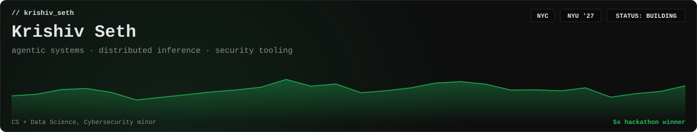
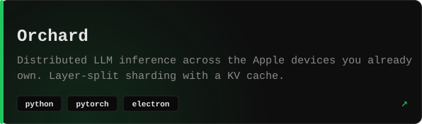
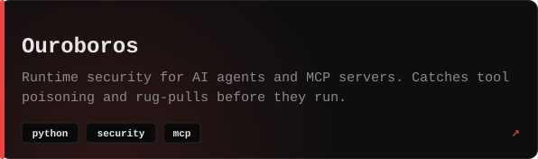
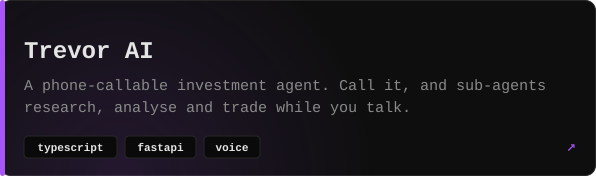
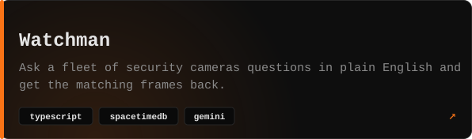
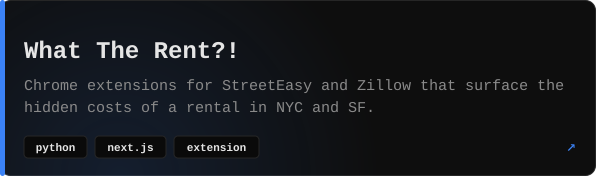
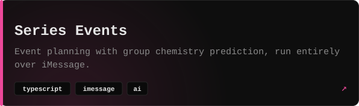

<p>
  <a href="https://github.com/krishivseth/Orchard"></a> <a href="https://github.com/krishivseth/Ouroboros"></a>
</p>
<p>
  <a href="https://github.com/krishivseth/TrevorAI"></a> <a href="https://github.com/krishivseth/watchman"></a>
</p>
<p>
  <a href="https://github.com/krishivseth/where2liv"></a> <a href="https://github.com/krishivseth/S_Events"></a>
</p>

```
// experience
2026  Clear Street        security engineering
2026  Forkast             forward deployed engineering   (Antler '25)
2025  Exar North Group    ai software engineering
2025  GoTrust             ai engineering
2025  Kanlet              software engineering
2024  Ambee               data science
2023  UPL                 cybersecurity

// research
      NYU OSIRIS Lab      byzantine fault tolerance, attack surfaces in agentic AI
      Harvard Business    NLP + data infra for group behaviour on social media
      NYU Langone         data infrastructure for neuroscience research

// awards
      grand prize         YC Startup School · Antler · Microsoft x Musa Capital · Khosla x ForgeHacks
      people's choice     Google x HackNYU
```

<p>
  <a href="https://krishivseth.com">krishivseth.com</a> · <a href="https://www.linkedin.com/in/krishiv-seth/">LinkedIn</a> · open to hard problems in agents, inference, and security
</p>
