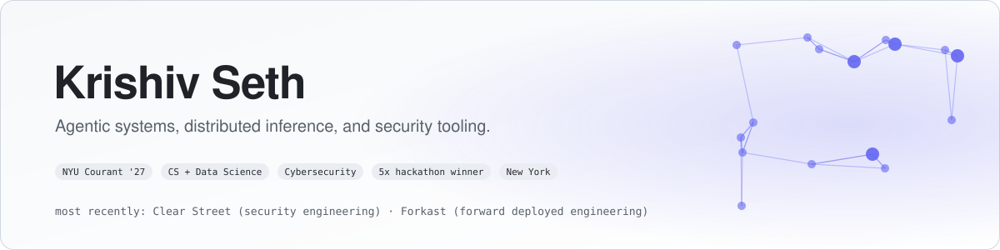
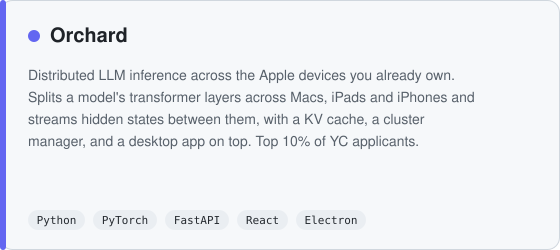
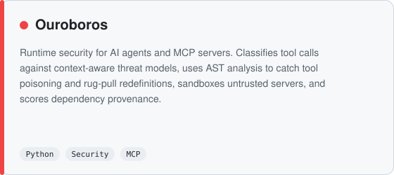
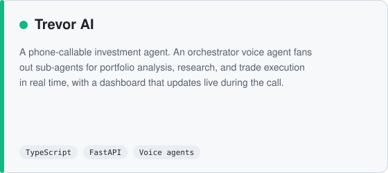
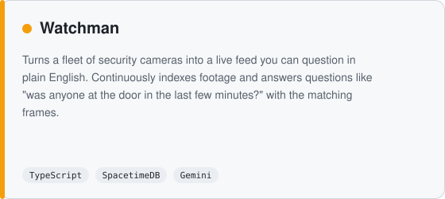
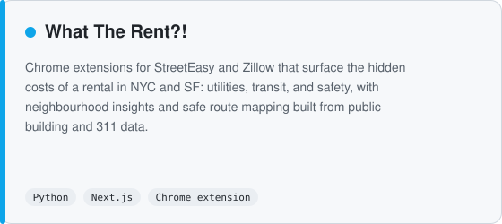
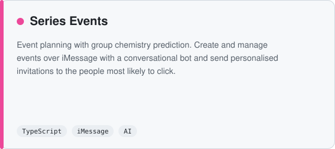

<picture>
  <source media="(prefers-color-scheme: dark)" srcset="assets/banner-dark.svg">
  
</picture>

  
  
  

## What I'm building

  <a href="https://github.com/krishivseth/Orchard"><picture><source media="(prefers-color-scheme: dark)" srcset="assets/orchard-dark.svg"></picture></a>
  <a href="https://github.com/krishivseth/Ouroboros"><picture><source media="(prefers-color-scheme: dark)" srcset="assets/ouroboros-dark.svg"></picture></a>
  <a href="https://github.com/krishivseth/TrevorAI"><picture><source media="(prefers-color-scheme: dark)" srcset="assets/trevor-dark.svg"></picture></a>
  <a href="https://github.com/krishivseth/watchman"><picture><source media="(prefers-color-scheme: dark)" srcset="assets/watchman-dark.svg"></picture></a>
  <a href="https://github.com/krishivseth/where2liv"><picture><source media="(prefers-color-scheme: dark)" srcset="assets/rent-dark.svg"></picture></a>
  <a href="https://github.com/krishivseth/S_Events"><picture><source media="(prefers-color-scheme: dark)" srcset="assets/series-dark.svg"></picture></a>

## Where I've worked

| Company | Role | Work |
|---|---|---|
| **Clear Street** | Security Engineering Intern · Summer 2026 | An app-sec agent harness that reasons over code property graphs to find real vulnerabilities in large codebases, plus the streaming data pipelines the security team's detections and agents run on. |
| **Forkast** (Antler '25) | Forward Deployed Engineering Intern · 2026 | First engineering intern on the FDE team. Demand forecasting and AI-native revenue intelligence shipped end to end for enterprise clients. |
| **Exar North Group** | AI Software Engineering Intern · 2025 | An agentic research platform across equities, loans, and credit, and a serverless newsletter agent for macro and equity research. |
| **GoTrust** | AI Engineering Intern · 2025 | On-prem GraphRAG natural-language-to-SQL on quantized local models for compliance teams in regulated environments. |
| **Kanlet** | Software Engineering Intern · 2025 | A full-stack competitor tracking feature inside a sales CRM. |
| **Ambee** | Data Science Intern · 2024 | Time-series models for public health risk forecasting and revenue planning. |
| **UPL** | Cybersecurity Intern · 2023 | Threat intelligence and incident response on the IS governance team. |

<table>
  <tr>
    <td width="50%" valign="top">
      <h3>Research</h3>
      <ul>
        <li><b>NYU OSIRIS Lab</b>: Byzantine fault tolerance, and tooling for emerging attack surfaces in agentic AI and blockchain systems.</li>
        <li><b>Harvard Business School</b>: NLP models and data infrastructure for measuring group behaviour on social media.</li>
        <li><b>NYU Langone Health</b>: data infrastructure supporting neuroscience research.</li>
      </ul>
    </td>
    <td width="50%" valign="top">
      <h3>Awards</h3>
      <ul>
        <li><b>Grand Prize</b> at Y Combinator Startup School, Antler, Microsoft x Musa Capital, and Khosla Ventures x ForgeHacks.</li>
        <li><b>People's Choice</b> at Google x HackNYU.</li>
        <li>Y Combinator Startup School (flown out) · CodePath Cybersecurity (Honors) · AI in Education VIP.</li>
      </ul>
    </td>
  </tr>
</table>

## Tools I reach for

  
  
  
  
  
  
  
  
  
  
  
  
  
  
  
  

  <b>Infrastructure:</b> streaming data pipelines, DevSecOps, distributed systems, gRPC, CI/CD 
  <b>AI and ML:</b> agentic systems, RAG and GraphRAG, LLM fine-tuning and quantization, distributed inference and model sharding, time-series modelling, evaluation harnesses

  Off-screen: photography, gym, guitar. Open to hard problems in agents, inference, and security.

