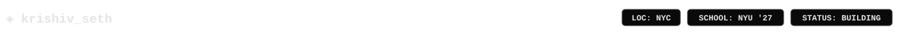

  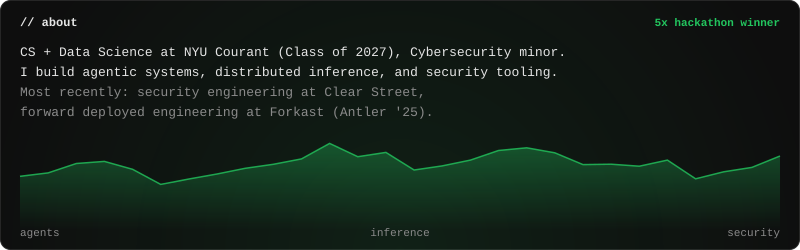 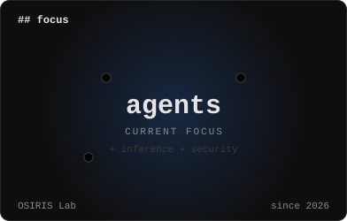

  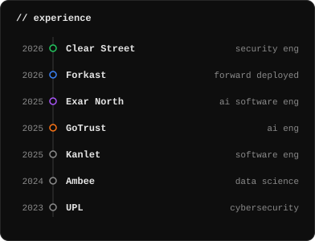 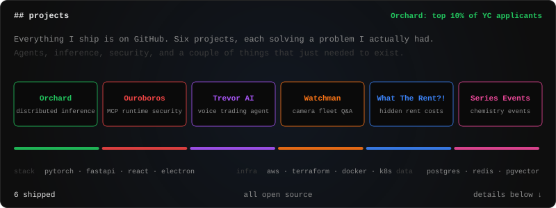

  <a href="https://github.com/krishivseth/Orchard">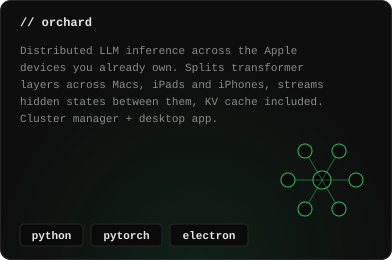</a>  <a href="https://github.com/krishivseth/TrevorAI">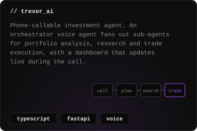</a>

  <a href="https://github.com/krishivseth/watchman">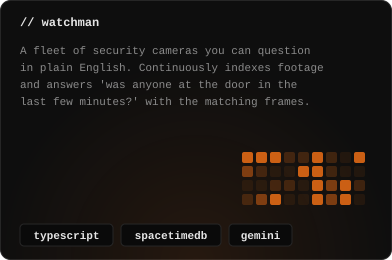</a>  <a href="https://github.com/krishivseth/S_Events">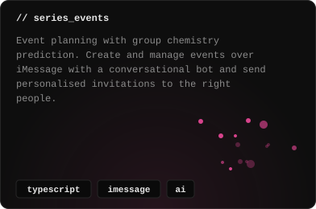</a>

  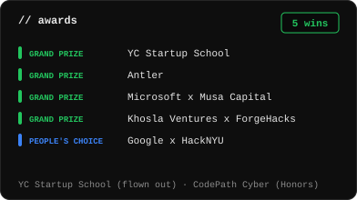 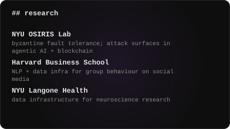 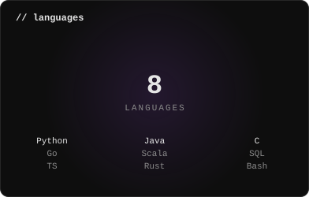

  <a href="https://krishivseth.com">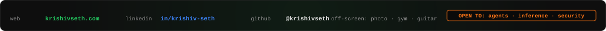</a>

  <a href="https://krishivseth.com">krishivseth.com</a> · <a href="https://www.linkedin.com/in/krishiv-seth/">LinkedIn</a> · panels are generated SVGs, source in <code>gen.py</code>

