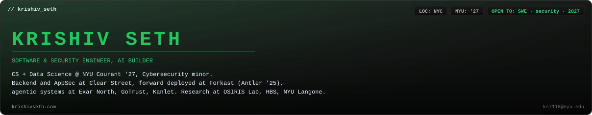

CS + Data Science at NYU, class of '27, with a cybersecurity minor. I like hard problems, shipping fast, and people who do both.

**Now:** researching attack surfaces in agentic and decentralised systems at NYU's [OSIRIS Lab](https://osiris.cyber.nyu.edu). Last summer I was at Clear Street doing backend and application security work: a Go log pipeline on Kinesis and an agent harness that reads code property graphs to find vulnerabilities across a monorepo. Before that, first engineering intern on the forward deployed team at Forkast (Antler '25).

**Things I've built**

- [Rewind](https://github.com/krishivseth/Rewind-poc) — time-travel debugger for coding-agent sessions. Scrub back to any step, see exactly what the model saw, fork with a different model, diff the branches. [Live here.](https://rewind-production-a902.up.railway.app)
- [Orchard](https://github.com/krishivseth/Orchard) — distributed inference and federated fine-tuning across the Apple Silicon machines you already own. Top 10% of YC applicants.
- [Ouroboros](https://github.com/krishivseth/Ouroboros) — runtime detection for MCP tool calls. Catches tool poisoning, cross-server shadowing, and rug-pulls before they run.
- [What The Rent?!](https://github.com/krishivseth/where2liv) — Chrome extensions for StreetEasy and Zillow that surface the hidden costs of a rental in NYC and SF. Won Microsoft x Musa Capital and Khosla Ventures x ForgeHacks. [On the Chrome Web Store.](https://chromewebstore.google.com/detail/what-the-rent-hidden-cost/dlkbfepombacndnkmmjojkegiondfhfl)
- [Trevor AI](https://github.com/krishivseth/TrevorAI) — call a phone number, sub-agents research and trade for you while you talk.
- Plop — any room into a 2D/3D interior design with Qwen-VL and real, swappable products. Built in three hours, won the YC Startup School hackathon.
- Yieldly — farms upload what they've got, farm-to-table restaurants get AI-priced menus from it. Won the Antler hackathon.
- NutriMap — an agent over scraped NYC menus that picks your meals from your macros. People's Choice at Google x HackNYU.

**Before that:** Exar North (agentic finance research platform, 300+ write-ups a week), GoTrust (GraphRAG NL-to-SQL on a 3B model, on-prem), Kanlet (full-stack CRM feature), Ambee (time-series ILI forecasting), UPL (threat intel, traced a live incident). Research with Harvard Business School and NYU Langone.

**Off-screen:** photography, gym, guitar.

[krishivseth.com](https://krishivseth.com) · [LinkedIn](https://www.linkedin.com/in/krishiv-seth/) · ks7118@nyu.edu
