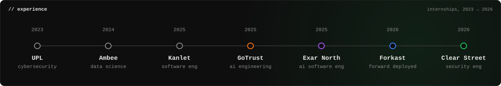
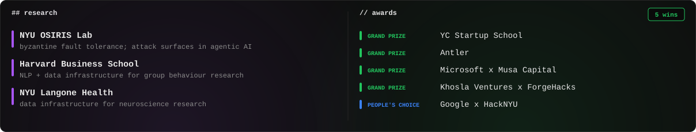

   

   

   

  <a href="https://krishivseth.com">krishivseth.com</a> · <a href="https://www.linkedin.com/in/krishiv-seth/">LinkedIn</a> · open to hard problems in agents, inference, and security

